# [Aura Theme](https://github.com/daltonmenezes/aura-theme)

### [Download all](https://github.com/daltonmenezes/aura-theme/archive/refs/heads/main.zip)

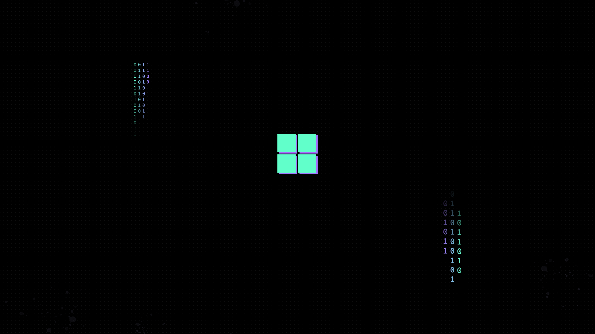
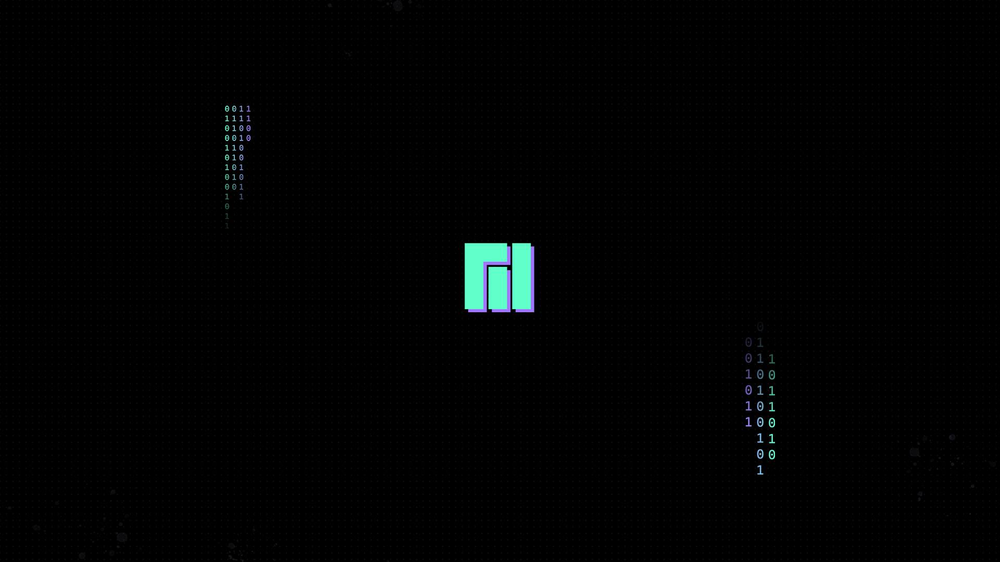
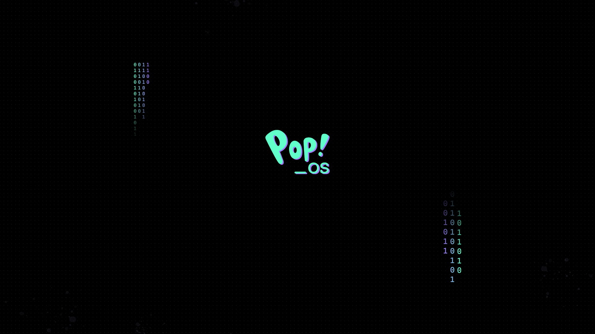
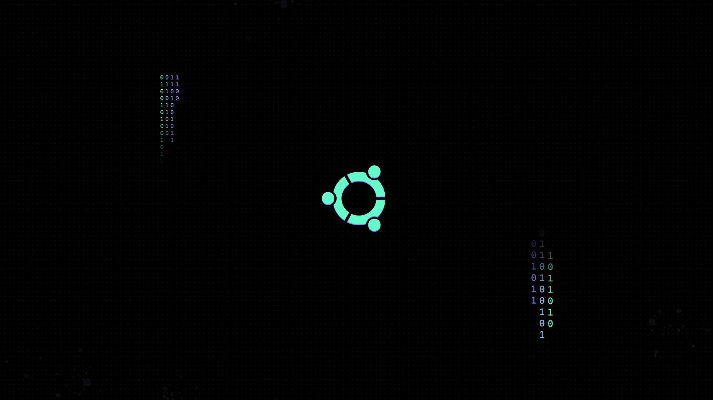
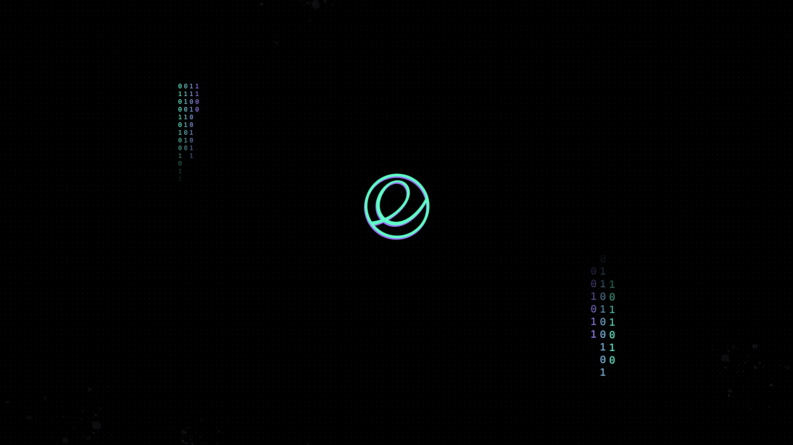
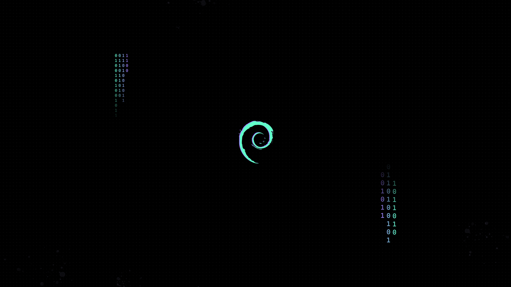
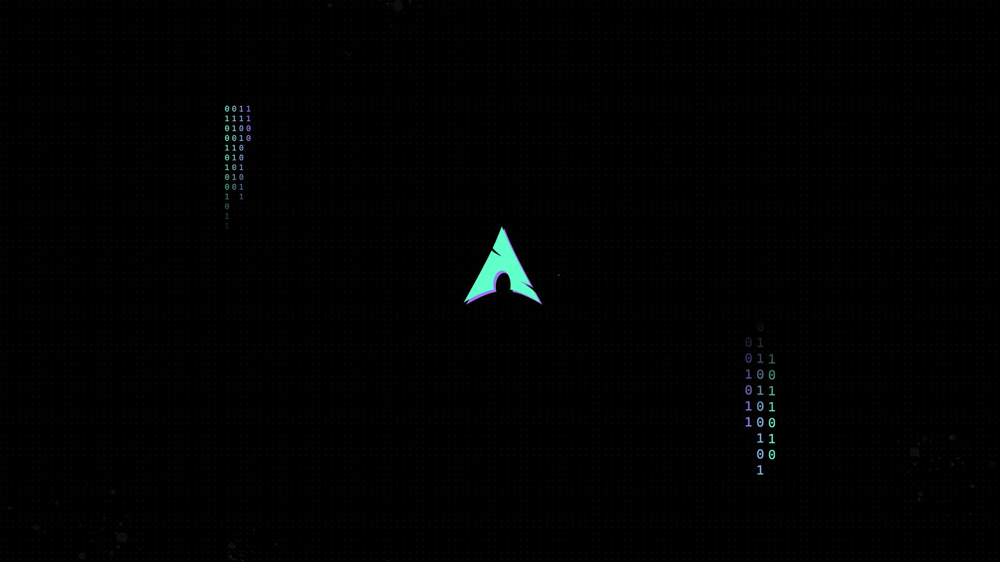

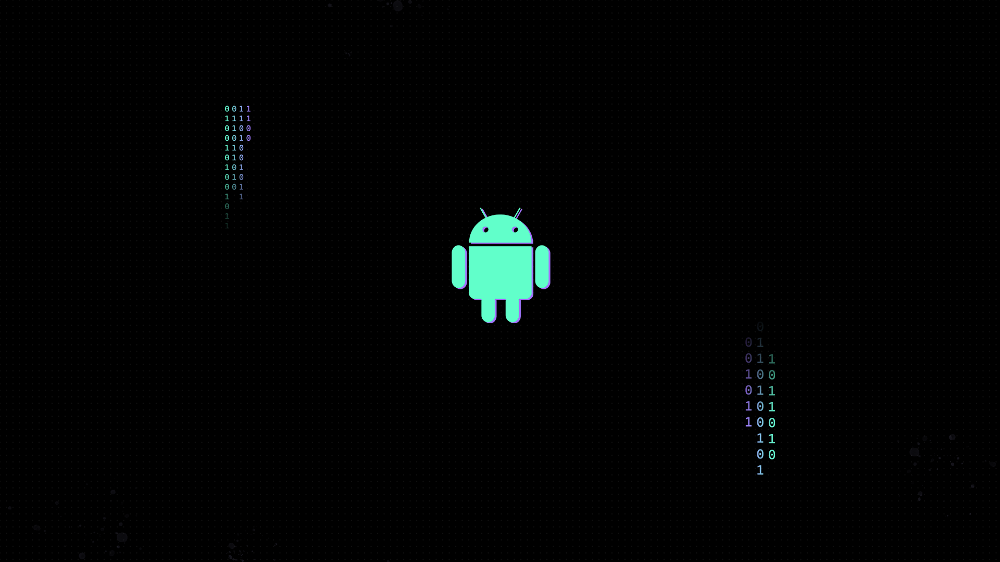
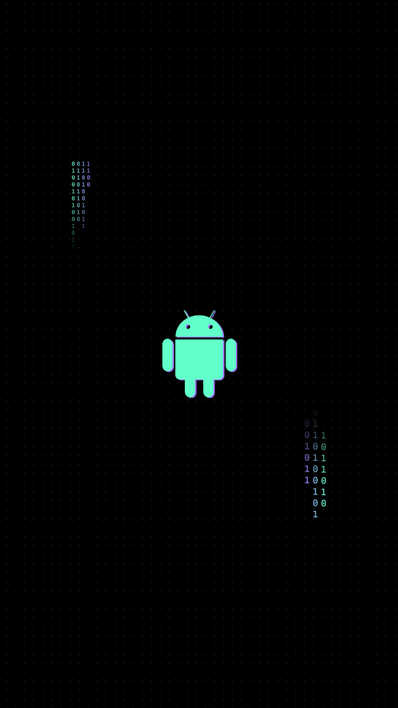
  
  
Lockscreen wallpapers
  
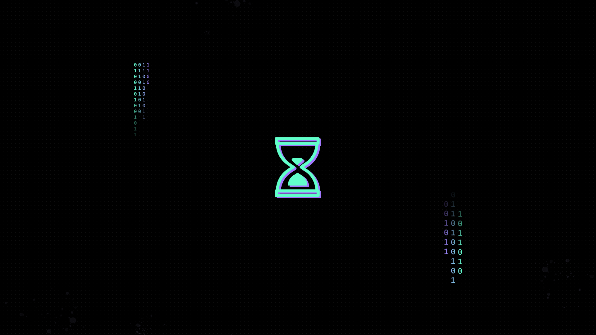
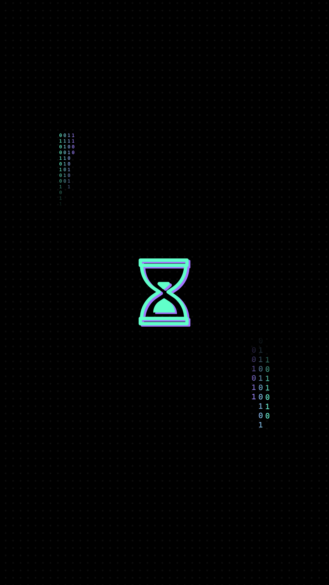

The design is based on the `type 0` [wallpaper from Aura Theme](https://github.com/daltonmenezes/aura-theme/tree/main/packages/wallpapers#type-0) with little tweaks.

If you didn't find a wallpaper for your OS, you can make one for yourself using [this template](https://github.com/uttsav1025/wallpapers-for-aura-theme/raw/main/edit_for_your_OS.psd) .

By

[![uttsav1025](https://github.com/uttsav1025.png?size=
