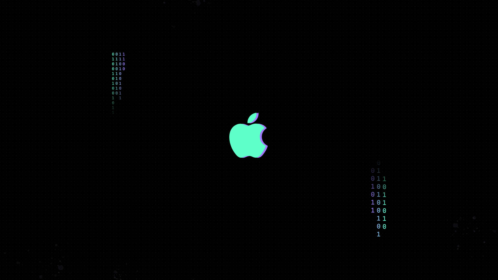

# [Aura Theme](https://github.com/daltonmenezes/aura-theme)

---

### [Download all](https://github.com/daltonmenezes/aura-theme/archive/refs/heads/main.zip)

The design is based on the `type 0` [wallpaper from Aura Theme](https://github.com/daltonmenezes/aura-theme/tree/main/packages/wallpapers#type-0) with little tweaks.

By

  |
---  |
[uttsav1025](https://github.com/uttsav1025) |
